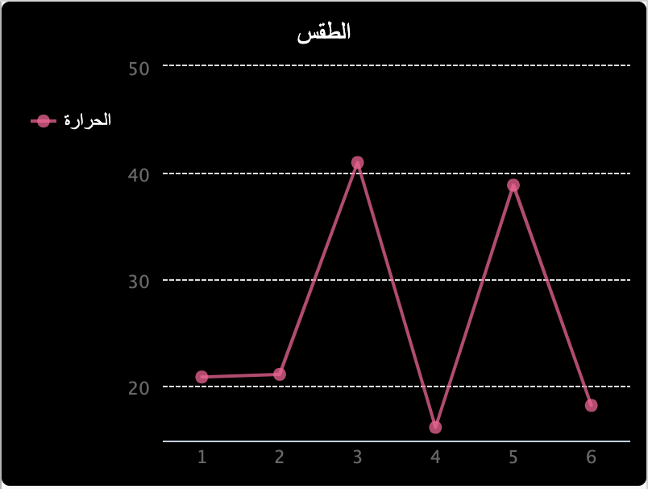

## المقدمة:

في هذا المشروع ، ستقوم بجمع البيانات من مستشعرات Sense HAT وتسجيلها في ملف. ثم ستستخدم وحدة PyGal لعرض تلك البيانات كرسم بياني خطي.

  <iframe src="https://trinket.io/embed/python/f04e603f18?outputOnly=true&start=result" width="600" height="500" frameborder="0" marginwidth="0" marginheight="0" allowfullscreen mark="crwd-mark">
</iframe> 

### معلومات إضافية لقادة النادي 

إذا كنت بحاجة إلى طباعة هذا المشروع، فيُرجى استخدام [النسخة القابلة للطباعة](https://projects.raspberrypi.org/ar-SA/projects/weather-logger/print).

--- collapse ---
---
title: ملاحظات لقادة النادي
---

## مقدمة:

في هذا المشروع ، سيتعلم الأطفال كيفية حفظ البيانات من مستشعرات Sense HAT إلى ملف ثم عرض البيانات على رسم بياني باستخدام Pygal.

## الموارد المتوفرة على الإنترنت

**يستخدم هذا المشروع لغة Python 3.** نوصي بإستخدام محاكي [trinket](https://trinket.io/) للكتابة بلغة الـ Python عبر الانترنت. يحتوي هذا المشروع على Trinket التالية:

* ['سجل الطقس' Trinket البدء-- jumpto.cc/weather-go](http://jumpto.cc/weather-go)

وهناك أيضًا trinket تحتوي على المشروع المكتمل:

* [انتهى "مسجل الطقس" - trinket.io/python/f04e603f18](https://trinket.io/python/f04e603f18)

## الموارد المتوفرة دون اتصال بالإنترنت

يمكن أيضًا إكمال هذا المشروع [بدون اتصال جهازك بالإنترنت](https://www.codeclubprojects.org/en-GB/resources/physical-sense-hat/) على جهاز الحاسوب Raspberry Pi مع Sense HAT. يمكنك الوصول إلى موارد المشروع من خلال النقر فوق رابط "مواد المشروع" الخاص بهذا المشروع. يحتوي هذا الرابط على قسم "موارد المشروع"، الذي يتضمن الموارد التي يحتاج إليها الأطفال لإكمال هذا المشروع من دون اتصال بالإنترنت. تأكد من أن كل طفل لديه حق الوصول إلى نسخة من هذه الموارد. يتضمن هذا القسم الملفات التالية:

* weather/main.py
* weather/collect.py
* weather/display.py
* weather/weather.txt

يمكنك أيضًا العثور على نسخة كاملة من هذا المشروع في قسم "موارد المتطوعين"، الذي يحتوي على:

* weather-finished/main.py
* weather-finished/collect.py
* weather-finished/display.py
* weather-finished/weather.txt

(جميع الموارد المذكورة أعلاه قابلة للتنزيل أيضًا كملفات `.zip` للمشاريع والمتطوعين)

## أهداف التعلم

* الحوسبة الفيزيائية - أجهزة الاستشعار ؛;
* البيانات - الكتابة إلى الملفات والقراءة منها.

يتناول هذا المشروع عناصر من معايير المناهج الرقمية الخاصة بـ [Raspberry Pi](http://rpf.io/curriculum):

* [إنشاءات برمجية مدمجة لحل مشكلة.](https://www.raspberrypi.org/curriculum/programming/builder)

## التحديات

* محاكاة الظروف الجوية المختلفة - استخدم محاكي Sense HAT لمحاكاة الظروف الجوية المختلفة. 
* تسجيل وعرض الرطوبة أو الضغط - تسجيل البيانات من مستشعر SAT HAT مختلف ورسم النتائج. 

--- /collapse ---

--- collapse ---
---
title: مواد المشروع
---

## موارد المشروع

* [ملف.zip يحتوي على جميع موارد المشروع](resources/weather-logger-project-resources.zip)
* [مشروع بداية مسجل الطقس](http://jumpto.cc/weather-go)
* [ملف Python بدون الاتصال بالانترنت](resources/weather-logger-main.py)
* [ملف Python غير متصل بالانترنيت لجمع البيانات](resources/weather-logger-collect.py)
* [ملف Python غير متصل لعرض البيانات](resources/weather-logger-display.py)
* [ملف بيانات الطقس دون اتصال](resources/weather--loggerweather.txt)

## موارد قادة النادي

* [ملف.zip يحتوي على جميع موارد المشروع المكتملة](resources/weather-logger-volunteer-resources.zip)
* [مشروع Trinket المكتمل على الإنترنت](https://trinket.io/python/f04e603f18)
* [ملف Python بدون الاتصال بالانترنت](resources/weather-logger-finished-main.py)
* [ملف Python غير متصل بالانترنيت لجمع البيانات](resources/weather-logger-finished-collect.py)
* [ملف Python غير متصل لعرض البيانات](resources/weather-logger-finished-display.py)
* [ملف بيانات الطقس دون اتصال](resources/weather-logger-finished-weather.txt)

--- /collapse ---