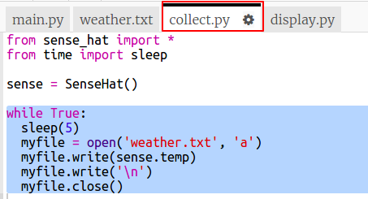

## تسجيل درجة الحرارة

لنقم أولاً بتسجيل درجة الحرارة في ملف كل 5 ثوانٍ. يمكنك استخدام المحاكي لتغيير درجة الحرارة.

+ افتح سجل درجات الطقس بدايةTrinket: <a href="http://jumpto.cc/weather-go" target="_blank">jumpto.cc/weather-go</a>.
    
    **تم إضافة بعض الملفات والتعليمات البرمجية لك.**

+ انقر فوق `collect.py`. هذا هو المكان الذي ستكتب فيه التعليمات البرمجية لجمع بيانات درجة الحرارة. لنفتح ملف `weather.txt` ملف وكتابة درجة الحرارة إليها كل خمس ثوان.
    
    أضف التعليمات البرمجية المميزة إلى `collect.py`:
    
    
    
    فتح الملف باستخدام `a` يعني أنه سيتم إلحاق البيانات بنهاية الملف.
    
    كتابة حرف خط جديد `\n` يضع كل قراءة درجة حرارة على سطرها الخاص.

+ انقر فوق `weather.txt`. يجب أن تكون فارغة. هذا هو المكان الذي سيتم تخزين البيانات فيه.
    
    

+ الآن انقر فوق تشغيل. استخدام شريط تمرير درجة الحرارة على المحاكي لتغيير درجة الحرارة. يجب أن ترى قراءة درجة الحرارة تضاف إلى نهاية `weather.txt` كل خمس ثوان.
    
    تذكر أن المحاكي يحاول أن يتصرف مثل "Sense HAT حقيقي" لذلك لن ترى نفس القراءة بالضبط حتى لو كنت لا تغير المحاكي.
    
    

+ انقر فوق زر `إيقاف` المربع عند الانتهاء من جمع البيانات.
    
    

+ يمكنك تمييز البيانات في `weather.txt` وحذفها إذا كنت ترغب في البدء في جمع بيانات درجة الحرارة الجديدة. اجمع حوالي 10 قراءات لدرجة الحرارة.