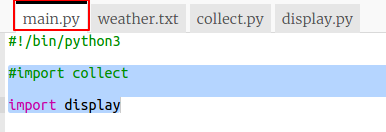
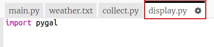
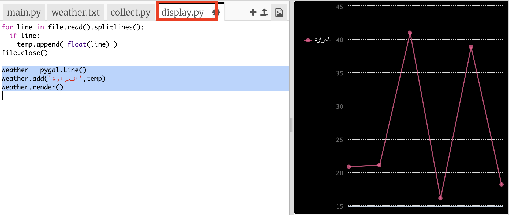
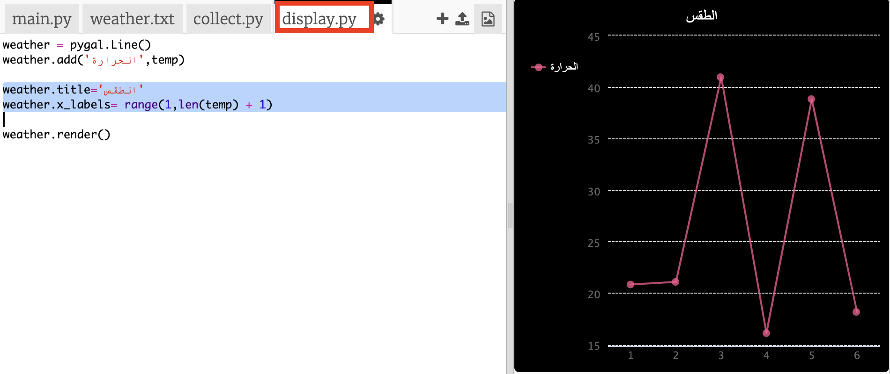

## إنشاء رسم بياني لدرجة الحرارة

الآن لقد جمعت بعض بيانات درجة الحرارة ، فلنظهرها على الرسم البياني الخطي.

+ انقر فوق `main.py `. في الوقت الحالي تستورد النسخة البرمجية `collect.py` التي كتبتها لجمع بيانات درجة الحرارة. الآن قم بتغييره بحيث يستورد النسخة البرمجية `display.py` بدلاً من ذلك.
    
    التعليق خارج خط `جمع الاستيراد` بإضافة `#` في البداية وإزالة `#` من بداية خط`عرض الاستيراد`.
    
    الآن يجب أن يبدو الملف الخاص بك مثل هذا:`main.py`:
    
    

+ انقر فوق `display.py` للعمل على الكود لعرض البيانات. ستستخدم مكتبة Pygal التي تم تضمينها لك.
    
    

+ أضف التعليمات البرمجية المميزة لقراءة القيم من `weather.txt` ملف في قائمة تسمى `درجة الحرارة `.
    
    

+ قم بتشغيل التعليمة البرمجية لرؤية القيم المطبعة. يمكنك إزالة سطر `طباعة` عندما تكون قد اختبرت التعليمات البرمجية الخاص بك.

+ الآن دعونا نضيف التعليمات البرمجية لإنشاء رسم بياني خطي من البيانات باستخدام Pygal.
    
    

+ يقوم Pygal تلقائيًا بإنشاء تسميات للمحور y من البيانات. دعنا نضيف عنوانًا وتسميات لمحور x. يمكننا ترقيم القراءات بدءًا من 1. نحن بحاجة إلى إضافة واحدة إلى طول قائمة درجات الحرارة حتى يعيد ذلك النطاق قائمة بالأرقام التي تنتقل من 1 إلى طول القائمة.
    
    أضف التعلميات البرمجية المميزة لإضافة عنوان وتسميات:
    
    