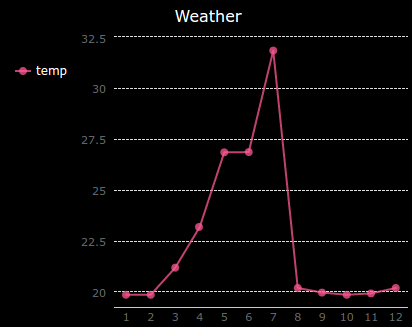

## Εισαγωγή:

In this project you will collect data from the Sense HAT's sensors and log it to a file. Then you will use the PyGal module to display that data as a line graph.

  <iframe src="https://trinket.io/embed/python/5e246d8212?outputOnly=true&start=result" width="600" height="500" frameborder="0" marginwidth="0" marginheight="0" allowfullscreen mark="crwd-mark">
</iframe> 

### Πρόσθετες πληροφορίες για τους αρχηγούς των ομάδων

Αν χρειαστεί να εκτυπώσεις αυτό το έργο, χρησιμοποίησε την [εκτυπώσιμη έκδοση](https://projects.raspberrypi.org/en/projects/weather-logger/print).

## \--- collapse \---

## title: Σημειώσεις συντονιστή ομάδας

## Εισαγωγή:

In this project, children will learn how to save data from the Sense HAT sensors to a file and then display the data on a graph with Pygal.

## Online Πόροι

**This project uses Python 3.** We recommend using [Trinket](https://trinket.io/) to write Python online. Το έργο αυτό περιλαμβάνει τα ακόλουθα Trinkets:

* ['Weather Logger' Starter Trinket -- jumpto.cc/weather-go](http://jumpto.cc/weather-go)

Υπάρχει επίσης ένα trinket που περιέχει το ολοκληρωμένο έργο:

* [‘Weather Logger’ Finished -- trinket.io/python/5e246d8212](https://trinket.io/python/5e246d8212)

## Offline Πόροι

This project can also be [completed offline](https://www.codeclubprojects.org/en-GB/resources/physical-sense-hat/) on a Raspberry Pi computer with a Sense HAT. Μπορείς να αποκτήσεις πρόσβαση στους πόρους του έργου κάνοντας κλικ στο σύνδεσμο «Υλικό έργου» για αυτό το έργο. Αυτός ο σύνδεσμος περιέχει μια ενότητα "Πόροι έργου", η οποία περιλαμβάνει υλικό που τα παιδιά θα χρειαστούν για να ολοκληρώσουν αυτό το έργο εκτός σύνδεσης. Βεβαιωθείτε ότι κάθε παιδί έχει πρόσβαση σε ένα αντίγραφο αυτών των πόρων. Αυτή η ενότητα περιλαμβάνει τα ακόλουθα αρχεία:

* weather/main.py
* weather/collect.py
* weather/display.py
* weather/weather.txt

Μπορείς επίσης να βρεις μια ολοκληρωμένη έκδοση αυτού του έργου στην ενότητα «Πόροι εθελοντών», η οποία περιέχει:

* weather-finished/main.py
* weather-finished/collect.py
* weather-finished/display.py
* weather-finished/weather.txt

(Όλοι οι παραπάνω πόροι μπορούν επίσης να κατέβουν ως συμπιεσμένα `.zip` αρχεία.)

## Στόχοι μάθησης

* Physical computing - sensors;
* Data - writing to and reading from files.

Αυτό το έργο καλύπτει στοιχεία από τις ακόλουθες πτυχές του [Προγράμματος Μαθημάτων Ψηφιακής Δημιουργίας του Raspberry Pi](http://rpf.io/curriculum):

* [Συνδύασε δομές προγραμματισμού για να λύσεις ένα πρόβλημα.](https://www.raspberrypi.org/curriculum/programming/builder)

## Προκλήσεις

* Simulate different weather conditions - use the Sense HAT emulator to simulate different weather conditions. 
* Record and display humidity or pressure - record data from a different Sense HAT sensor and graph the results. 

\--- /collapse \---

## \--- collapse \---

## title: Υλικό έργου

## Πόροι έργου

* [αρχείο .zip που περιέχει όλους τους πόρους του έργου](resources/weather-logger-project-resources.zip)
* [Weather Logger starter project](http://jumpto.cc/weather-go)
* [Offline starter Python file](resources/weather-logger-main.py)
* [Offline Python file for collecting data](resources/weather-logger-collect.py)
* [Offline Python file for displaying data](resources/weather-logger-display.py)
* [Offline weather data file](resources/weather--loggerweather.txt)

## Πόροι συντονιστή ομάδας

* [αρχείο .zip που περιέχει όλους τους πόρους του έργου](resources/weather-logger-volunteer-resources.zip)
* [Online completed Trinket Tightrope project](https://trinket.io/python/5e246d8212)
* [Offline starter Python file](resources/weather-logger-finished-main.py)
* [Offline Python file for collecting data](resources/weather-logger-finished-collect.py)
* [Offline Python file for displaying data](resources/weather-logger-finished-display.py)
* [Offline weather data file](resources/weather-logger-finished-weather.txt)

\--- /collapse \---