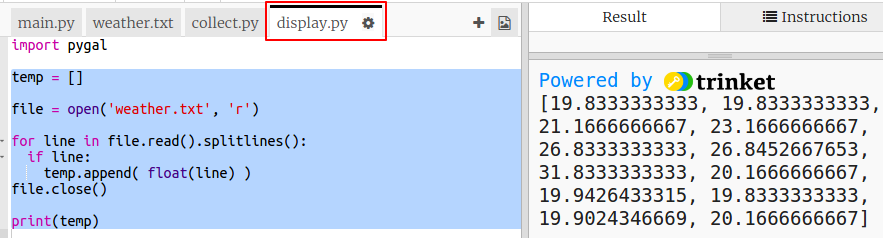

## Creating a temperature graph

Now you've collected some temperature data let's show it on a line graph. 

+ Click on `main.py`. At the moment it imports the `collect.py` script that you wrote to collect the temperature data. Now change it so that it imports the `display.py` script instead. 

    Comment out the `import collect` line by adding a `#` at the beginning and remove the `#` from the beginning of the `import display` line. 
    
    `main.py` should now look like this:
    
    

+ Click on `display.py` to work on the code for displaying the data. You'll be using the Pygal library which has been included for you. 

    

+ Add the highlighted code to read the values from the `weather.txt` file into a list called `temp`.  

    
    
+ Run the code to see the values printed out. You can remove the `print` line when you have tested your code.

+ Now let's add the code to create a line graph from the data using Pygal.   
    
    
   
+ Pygal automatically creates labels for the y axis from the data. Let's add a title and labels for the x axis. We can number the readings starting from 1. We need to add one to the length of the temperature list so that range will return a list of numbers that goes from 1 up to the length of the list. 

    Add the highlighted code to add a title and labels:
    
    
    
    
