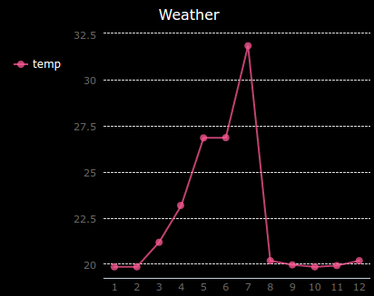

## Introducción:

In this project you will collect data from the Sense HAT's sensors and log it to a file. Then you will use the PyGal module to display that data as a line graph.

  <iframe src="https://trinket.io/embed/python/5e246d8212?outputOnly=true&start=result" width="600" height="500" frameborder="0" marginwidth="0" marginheight="0" allowfullscreen mark="crwd-mark">
</iframe> 

### Información adicional para líderes de club

Si necesitas imprimir este proyecto, usa la [versión para imprimir](https://projects.raspberrypi.org/en/projects/weather-logger/print).

## \--- collapse \---

## título: Notas del líder del club

## Introducción:

In this project, children will learn how to save data from the Sense HAT sensors to a file and then display the data on a graph with Pygal.

## Recursos en línea

**This project uses Python 3.** We recommend using [Trinket](https://trinket.io/) to write Python online. Este proyecto contiene los Trinkets siguientes:

* ['Weather Logger' Starter Trinket -- jumpto.cc/weather-go](http://jumpto.cc/weather-go)

También hay un Trinket que contiene el proyecto completo:

* [‘Weather Logger’ Finished -- trinket.io/python/5e246d8212](https://trinket.io/python/5e246d8212)

## Recursos sin conexión

This project can also be [completed offline](https://www.codeclubprojects.org/en-GB/resources/physical-sense-hat/) on a Raspberry Pi computer with a Sense HAT. Se puede acceder a los recursos del proyecto haciendo clic en el enlace 'Materiales del proyecto' para este proyecto. Este enlace contiene una sección de 'Recursos del proyecto', que incluye los recursos que los niños necesitarán para completar este proyecto sin conexión. Asegúrese de que cada niño tenga acceso a una copia de estos recursos. Esta sección incluye los siguientes archivos:

* weather/main.py
* weather/collect.py
* weather/display.py
* weather/weather.txt

También se puede encontrar una versión completa de este proyecto en la sección 'Recursos para voluntarios', que contiene:

* weather-finished/main.py
* weather-finished/collect.py
* weather-finished/display.py
* weather-finished/weather.txt

(Todos los recursos anteriores también se pueden descargar como archivos `.zip` de proyectos y voluntarios.)

## Objetivos del Aprendizaje

* Physical computing - sensors;
* Data - writing to and reading from files.

Este proyecto incluye elementos de los siguientes aspectos del [currículo de digitalización de Raspberry Pi](http://rpf.io/curriculum):

* [Combinar estructuras de programación para resolver un problema.](https://www.raspberrypi.org/curriculum/programming/builder)

## Retos

* Simulate different weather conditions - use the Sense HAT emulator to simulate different weather conditions. 
* Record and display humidity or pressure - record data from a different Sense HAT sensor and graph the results. 

\--- /collapse \---

## \--- collapse \---

## title: Materiales del proyecto

## Recursos del proyecto

* [Archivo .zip que contiene todos los recursos del proyecto](resources/weather-logger-project-resources.zip)
* [Weather Logger starter project](http://jumpto.cc/weather-go)
* [Offline starter Python file](resources/weather-logger-main.py)
* [Offline Python file for collecting data](resources/weather-logger-collect.py)
* [Offline Python file for displaying data](resources/weather-logger-display.py)
* [Offline weather data file](resources/weather--loggerweather.txt)

## Recursos para los líderes de clubes

* [Archivo .zip que contiene todos los recursos de proyecto terminado](resources/weather-logger-volunteer-resources.zip)
* [Online completed Trinket Tightrope project](https://trinket.io/python/5e246d8212)
* [Offline starter Python file](resources/weather-logger-finished-main.py)
* [Offline Python file for collecting data](resources/weather-logger-finished-collect.py)
* [Offline Python file for displaying data](resources/weather-logger-finished-display.py)
* [Offline weather data file](resources/weather-logger-finished-weather.txt)

\--- /collapse \---