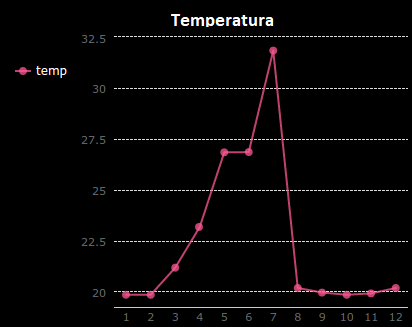

## Introducción

En este proyecto recolectarás datos de los sensores de Sense HAT y lo registrarás en un archivo. Luego usarás el módulo PyGal para mostrar esos datos como un gráfico de línea.

  <iframe src="https://trinket.io/embed/python/a1f1c31e84?outputOnly=true&start=result" width="600" height="500" frameborder="0" marginwidth="0" marginheight="0" allowfullscreen mark="crwd-mark">
</iframe> 

### Información adicional para los líderes del club

Si necesitas imprimir este proyecto, por favor usa la [ Versión para imprimir](https://projects.raspberrypi.org/es-LA/projects/weather-logger/print).

--- collapse ---
---
title: Notas para el líder del club
---

## Introducción:

En este proyecto, los niños aprenderán a guardar los datos de los sensores HAT Sense en un archivo y luego mostrarán los datos en un gráfico con Pygal.

## Recursos en línea

**Este proyecto utiliza Python 3.** Recomendamos usar [trinket](https://trinket.io/) para escribir Python en línea. Este proyecto contiene los siguientes Trinkets:

* [Trinket de inicio 'Registrador de clima' - jumpto.cc/weather-go](http://jumpto.cc/weather-go)

También hay un Trinket que contiene el proyecto completo:

* ['Registrador de clima' terminado -- trinket.io/python/a1f1c31e84](https://trinket.io/python/a1f1c31e84)

## Recursos fuera de línea

Este proyecto también se puede [completar sin conexión](https://www.codeclubprojects.org/en-GB/resources/physical-sense-hat/) en una computadora Raspberry Pi con un Sense HAT. Puedes acceder a los recursos de este proyecto al hacer clic en el enlace 'Materiales del Proyecto'. Este enlace contiene una sección llamada 'Recursos del proyecto', que incluye los recursos que los niños necesitarán para completar este proyecto cuando no cuenten con conexión a internet. Asegúrate de que cada niño tenga acceso a una copia de estos recursos. Esta sección incluye los siguientes archivos:

* weather/main.py
* weather/collect.py
* weather/display.py
* weather/weather.txt

También puedes encontrar una versión completa de este proyecto en la sección 'Recursos para Voluntarios', que contiene:

* weather-finished/main.py
* weather-finished/collect.py
* weather-finished/display.py
* weather-finished/weather.txt

(Todos los recursos anteriores también se pueden descargar como archivos `.zip` de proyectos y voluntarios.)

## Objetivos de Aprendizaje

* Informática física - sensores;
* Datos - escritura y lectura de archivos.

Este proyecto incluye elementos de los siguientes aspectos del [Currículo de Creación Digital de Raspberry Pi](http://rpf.io/curriculum):

* [Combinar estructuras de programación para resolver un problema.](https://www.raspberrypi.org/curriculum/programming/builder)

## Desafíos

* Simula diferentes condiciones climáticas: usa el emulador Sense HAT para simular diferentes condiciones climáticas. 
* Registra y visualiza la humedad o presión: registra datos de un sensor Sense HAT diferente y grafica los resultados. 

--- /collapse ---

--- collapse ---
---
title: Materiales del proyecto
---

## Recursos del proyecto

* [Archivo .zip que contiene todos los recursos del proyecto](resources/weather-logger-project-resources.zip)
* [Proyecto inicial Registrador de Clima](http://jumpto.cc/weather-go)
* [Archivo inicial Python sin conexión](resources/weather-logger-main.py)
* [Archivo Python sin conexión para recopilar datos](resources/weather-logger-collect.py)
* [Archivo Python sin conexión para mostrar datos](resources/weather-logger-display.py)
* [Archivo de datos meteorológicos sin conexión](resources/weather--loggerweather.txt)

## Recursos para los líderes del club

* [Archivo .zip que contiene todos los recursos del proyecto terminado](resources/weather-logger-volunteer-resources.zip)
* [Proyecto Trinket Tightrope completado en línea](https://trinket.io/python/a1f1c31e84)
* [Archivo inicial Python sin conexión](resources/weather-logger-finished-main.py)
* [Archivo Python sin conexión para recopilar datos](resources/weather-logger-finished-collect.py)
* [Archivo Python sin conexión para mostrar datos](resources/weather-logger-finished-display.py)
* [Archivo de datos meteorológicos sin conexión](resources/weather-logger-finished-weather.txt)

--- /collapse ---