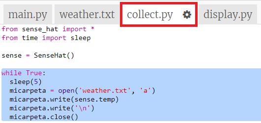
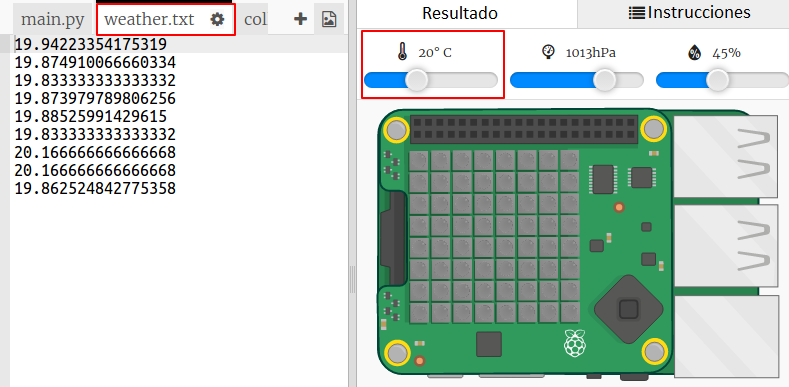

## Registrar la temperatura

Primero registremos la temperatura en un archivo cada 5 segundos. Puedes usar el emulador para cambiar la temperatura.

+ Abre el Trinket de inicio del Registro de Clima: <a href="http://jumpto.cc/weather-go" target="_blank"> jumpto.cc/weather-go </a> .
    
    **Algunos archivos y códigos han sido añadidos para ti.**

+ Haz clic en `collect.py`. Aquí es donde escribirás el código para recopilar los datos de temperatura. Abrimos el archivo `weather.txt` y escribimos la temperatura cada cinco segundos.
    
    Añade el código resaltado a `collect.py`:
    
    
    
    Abrir el archivo con `a` significa que los datos se añadirán al final del archivo.
    
    Escribir un carácter de nueva línea `\n` pone cada lectura de temperatura en su propia línea.

+ Haz clic en `weather.txt`. Debe estar vacío. Aquí se almacenarán los datos.
    
    

+ Ahora haz clic en Ejecutar. Usa el deslizador de temperatura en el emulador para cambiar la temperatura. Deberías ver la lectura de la temperatura añadida al final de `weather.txt` cada cinco segundos.
    
    Recuerda que el emulador intenta comportarse como un verdadero Sense HAT, así que no verás exactamente la misma lectura aunque no cambies el emulador.
    
    

+ Haz clic en el botón cuadrado `Detener` cuando hayas terminado de recolectar datos.
    
    

+ Puedes resaltar los datos en `weather.txt` y eliminarlos si quieres empezar a recolectar nuevos datos de temperatura. Recopila alrededor de 10 lecturas de temperatura.