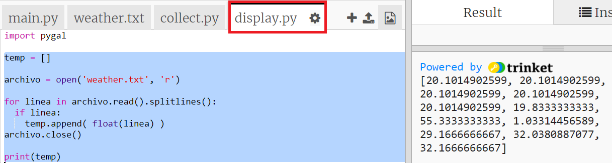
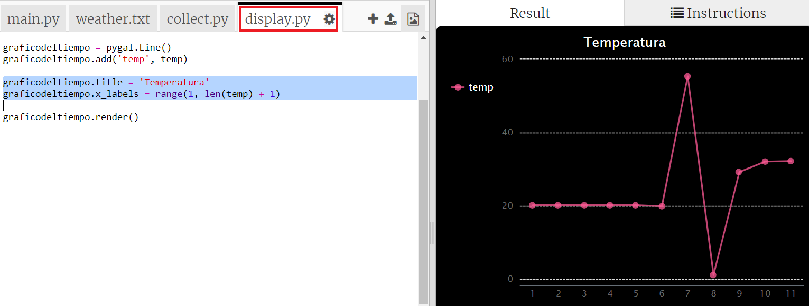

## Crear un gráfico de temperatura

Ahora que has recopilado algunos datos de temperatura, vamos a mostrarlos en un gráfico lineal.

+ Haz clic en `main.py`. Por el momento importa el script `collect.py` que escribiste para recolectar los datos de temperatura. Ahora cámbialo para que importe el script `display.py` en su lugar.
    
    Comenta la línea `import collect` añadiendo un `#` al principio y elimina el `#` desde el comienzo de la línea `import display`.
    
    `main.py` ahora debería verse así:
    
    

+ Haz clic en `display.py` para poder trabajar en el código y así mostrar los datos. Utilizarás la biblioteca Pygal que se ha incluido para ti.
    
    

+ Añade el código resaltado para leer los valores del archivo `weather.txt` en una lista llamada `temp`.
    
    

+ Ejecuta el código para ver los valores impresos. Puedes eliminar la línea `print` cuando hayas probado tu código.

+ Ahora agregamos el código para crear un gráfico lineal a partir de los datos usando Pygal.
    
    

+ Pygal crea automáticamente etiquetas para el eje y a partir de los datos. Agreguemos un título y etiquetas para el eje x. Podemos enumerar las lecturas empezando por el 1. Tenemos que añadir uno a la longitud de la lista de temperaturas para que el rango devuelva una lista de números que va de 1 a la longitud de la lista.
    
    Agrega el código resaltado para añadir un título y etiquetas:
    
    