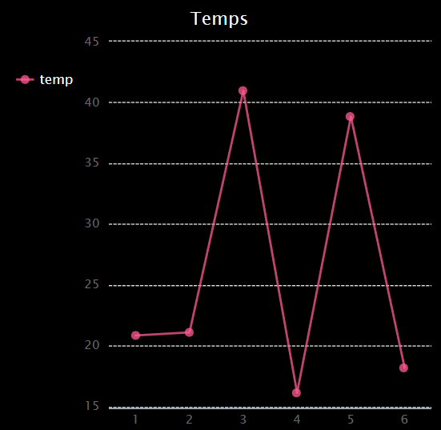

## Introduction :

Dans ce projet, tu vas collecter des données à partir des capteurs du Sense HAT et les enregistrer dans un fichier. Ensuite, tu utiliseras le module PyGal pour afficher ces données sous forme de graphique linéaire.

  <iframe src="https://trinket.io/embed/python/5e246d8212?outputOnly=true&start=result" width="600" height="500" frameborder="0" marginwidth="0" marginheight="0" allowfullscreen mark="crwd-mark">
</iframe> 

### Informations complémentaires pour les responsables de club

Si vous avez besoin d'imprimer ce projet, merci d'utiliser la [Version imprimable](https://projects.raspberrypi.org/fr-FR/projects/weather-logger/print).

--- collapse ---
---
title: Notes pour le responsable de club
---

## Introduction :

Dans ce projet, les enfants apprendront comment enregistrer les données des capteurs du « Sense HAT » dans un fichier, puis afficher les données sur un graphique avec Pygal.

## Ressources en ligne

**Ce projet utilise Python 3.** Nous vous recommandons d'utiliser [Trinket](https://trinket.io/) pour écrire du code Python en ligne. Ce projet contient les Trinkets suivants :

* [« Enregistreur météo » Démarrage Trinket -- jumpto.cc/weather-go](http://jumpto.cc/weather-go)

Il existe aussi ce trinket qui contient le projet terminé :

* [« Enregistreur météo » terminé - trinket.io/python/5e246d8212](https://trinket.io/python/5e246d8212)

## Ressources hors ligne

Ce projet peut également être [terminé hors ligne](https://www.codeclubprojects.org/en-GB/resources/physical-sense-hat/) sur un ordinateur Raspberry Pi avec un « Sense HAT ». Vous pouvez accéder aux ressources du projet en cliquant sur le lien "Matériel pour le projet". Ce lien contient une section "Ressources du projet" qui inclut les ressources dont les enfants auront besoin pour compléter le projet hors ligne. Assurez-vous que les enfants ont accès à une copie de ces ressources. Cette section inclut les fichiers suivants :

* weather/main.py
* weather/collect.py
* weather/display.py
* weather/weather.txt

Vous pouvez aussi trouver une version terminée du projet dans la section « Ressources du bénévole » qui contient :

* weather-finished/main.py
* weather-finished/collect.py
* weather-finished/display.py
* weather-finished/weather.txt

(Toutes les ressources ci-dessus peuvent aussi être téléchargées dans les fichiers`.zip` projet et bénévole)

## Objectifs d'apprentissage

* Informatique physique - capteurs ;
* Données - écriture et lecture à partir de fichiers.

Ce projet couvre les élements suivants du [Programme Raspberry Pi de Créativité Numérique](http://rpf.io/curriculum):

* [Combine des constructions de programmation pour résoudre un problème.](https://www.raspberrypi.org/curriculum/programming/builder)

## Défis

* Simule différentes conditions météorologiques - utilise l'émulateur Sense HAT pour simuler différentes conditions météorologiques. 
* Enregistre et affiche l'humidité ou la pression - enregistre les données d'un autre capteur Sense HAT et représente graphiquement les résultats. 

--- /collapse ---

--- collapse ---
---
title: Matériel pour le projet
---

## Ressources du projet

* [Fichier .zip contenant toutes les ressources du projet](resources/weather-logger-project-resources.zip)
* [Démarrage du projet « Enregistreur météo »](http://jumpto.cc/weather-go)
* [Fichier Python de démarrage hors ligne](resources/weather-logger-main.py)
* [Fichier Python hors ligne pour la collecte des données](resources/weather-logger-collect.py)
* [Fichier Python hors ligne pour l'affichage des données](resources/weather-logger-display.py)
* [Fichier de données météo hors ligne](resources/weather--loggerweather.txt)

## Ressources pour le responsable de club

* [Fichier .zip contenant toutes les ressources du projet](resources/weather-logger-volunteer-resources.zip)
* [Projet Trinket Tightrope en ligne terminé](https://trinket.io/python/5e246d8212)
* [Fichier Python de démarrage hors ligne](resources/weather-logger-finished-main.py)
* [Fichier Python hors ligne pour la collecte des données](resources/weather-logger-finished-collect.py)
* [Fichier Python hors ligne pour l'affichage des données](resources/weather-logger-finished-display.py)
* [Fichier de données météo hors ligne](resources/weather-logger-finished-weather.txt)

--- /collapse ---