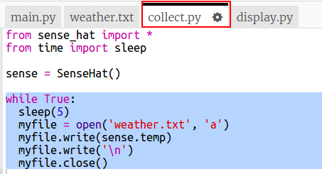

## Enregistrement de la température

Commençons par enregistrer la température dans un fichier toutes les 5 secondes. Tu peux utiliser l'émulateur pour modifier la température.

+ Ouvre le démarrage du projet « Enregistrement de la température » dans Trinket : <a href="http://jumpto.cc/weather-go" target="_blank">jumpto.cc/weather-go</a>.
    
    **Certains fichiers et codes ont été ajoutés pour toi.**

+ Clique sur `collect.py`. C'est là que tu vas écrire le code pour collecter les données de température. Ouvrons le fichier `weather.txt` et écrivons-y la température toutes les cinq secondes.
    
    Ajoute le code en surbrillance à `collect.py` :
    
    
    
    Ouvrir le fichier avec `a` signifie que les données seront ajoutées à la fin du fichier.
    
    L'écriture d'un caractère de nouvelle ligne `\n` met chaque mesure de température sur sa propre ligne.

+ Clique sur `weather.txt`. Il devrait être vide. C'est là que les données seront stockées.
    
    

+ Maintenant, clique sur Run. Utilise le curseur de température sur l'émulateur pour modifier la température. Tu devrais voir la lecture de la température ajoutée à la fin de `weather.txt` toutes les cinq secondes.
    
    N'oublie pas que l'émulateur essaie de se comporter comme un vrai « Sense HAT », tu ne verras donc pas exactement la même lecture même si tu ne changes pas l'émulateur.
    
    

+ Clique sur le bouton carré `Stop` quand tu auras fini de collecter des données.
    
    

+ Tu peux mettre en surbrillance les données dans `weather.txt` et les supprimer si tu veux commencer à collecter de nouvelles données de température. Collecte environ 10 relevés de température.