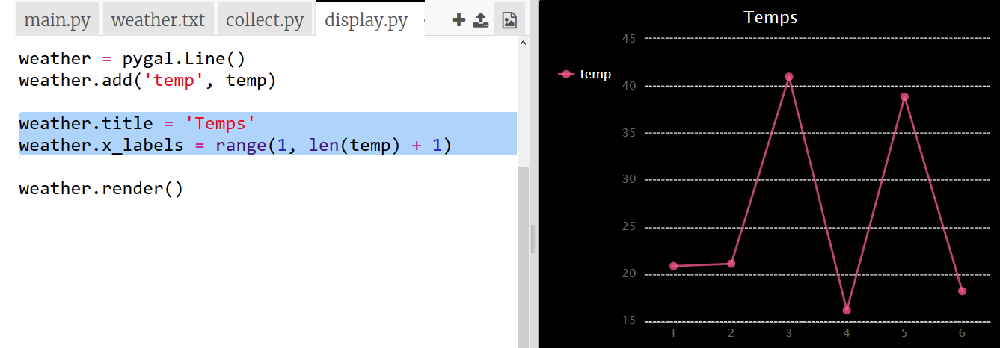

## Création d'un graphique de température

Maintenant que tu as collecté des données de température, montrons-les sur un graphique linéaire.

+ Clique sur `main.py`. A ce moment, il importe le script `collect.py` que tu as écrit pour collecter les données de température. Maintenant, modifie-le pour importer le script `display.py` à la place.
    
    Commente la ligne `import collect` en ajoutant un `#` au début et en retirant le `#` au début de la ligne `import display`.
    
    `main.py` devrait maintenant ressembler à ceci :
    
    

+ Clique sur `display.py` pour travailler sur le code pour afficher les données. Tu utiliseras la bibliothèque Pygal qui a été incluse pour toi.
    
    

+ Ajoute le code surligné pour lire les valeurs du fichier `weather.txt` dans une liste appelée `temp`.
    
    

+ Exécute le code pour voir les valeurs affichées. Tu peux supprimer la ligne `print` lorsque tu as testé ton code.

+ Maintenant, ajoutons le code pour créer un graphique linéaire à partir des données en utilisant Pygal.
    
    

+ Pygal crée automatiquement des étiquettes pour l'axe y à partir des données. Ajoutons un titre et des étiquettes pour l'axe des x. Nous pouvons numéroter les lectures à partir de 1. Nous devons en ajouter un à la longueur de la liste des températures afin que cette plage renvoie une liste de nombres allant de 1 à la longueur de la liste.
    
    Ajoute le code en surbrillance pour ajouter un titre et des étiquettes:
    
    