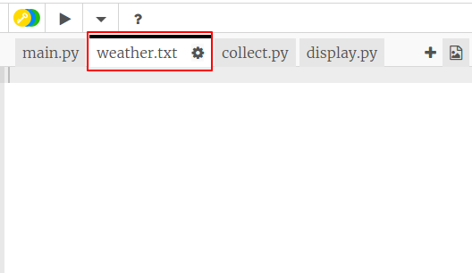
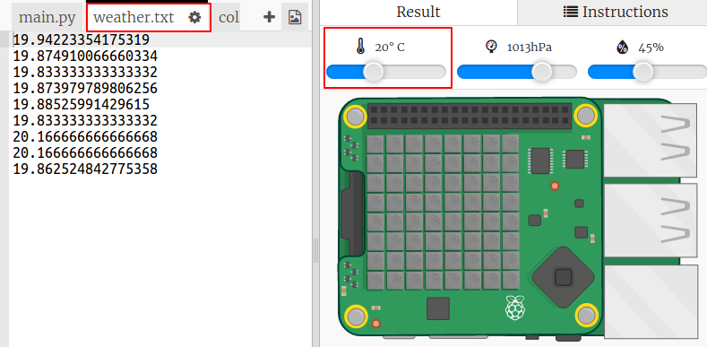

## तापमान रिकॉर्ड करना

आइए पहले हम तापमान को एक फ़ाइल में हर 5 सेकंड में लॉग करें। आप तापमान को बदलने के लिए एमुलेटर का उपयोग कर सकते हैं।

+ वेदर लॉगर स्टार्टर Trinket को खोलें: <a href="http://jumpto.cc/weather-go" target="_blank">jumpto.cc/weather-go</a>।
    
    **आपके लिए कुछ फाइलें और कोड जोड़े गए हैं।**

+ `collect.py` पर क्लिक करें। यह वह जगह है जहाँ आप तापमान डेटा एकत्र करने के लिए कोड लिखेंगे। आइए हम `weather.txt` फ़ाइल खोलें और उसमें हर पाँच सेकंड में तापमान लिखें।
    
    हाइलाइट किए गए कोड को `collect.py` में जोड़ें:
    
    
    
    फ़ाइल को `a` के साथ खोलने का मतलब है कि डेटा फ़ाइल के अंत में संलग्न किया जाएगा।
    
    नई पंक्ति के लिए अक्षर `\n` लिखने से प्रत्येक तापमान रीडिंग अपनी पंक्ति में ही रहती है।

+ `weather.txt` पर क्लिक करें। यह खाली होना चाहिए। यह वह जगह है जहाँ डेटा संगृहीत किया जाएगा।
    
    

+ अब Run पर क्लिक करें। तापमान को बदलने के लिए एमुलेटर पर तापमान स्लाइडर का उपयोग करें। आपको `weather.txt` के अंत में हर पाँच सेकंड में तापमान रीडिंग का जोड़ा जाना दिखाई देना चाहिए।
    
    याद रखें कि एमुलेटर एक वास्तविक Sense HAT की तरह व्यवहार करने की कोशिश करता है इसलिए चाहे आप एमुलेटर को न बदलें तो भी आपको ठीक वैसी ही रीडिंग दिखाई नहीं देगी।
    
    

+ जब आप डेटा एकत्र करना समाप्त कर लें तो चौकोर `Stop` बटन पर क्लिक करें।
    
    

+ यदि आप नए तापमान डेटा को एकत्र करना शुरू करना चाहते हैं तो आप `weather.txt` में डेटा को हाइलाइट कर सकते हैं और हटा सकते हैं। लगभग 10 तापमान रीडिंग एकत्र करें।