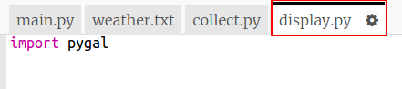

## तापमान ग्राफ बनाना

अब आपने कुछ तापमान डेटा एकत्र किया है, आइए इसे रेखा ग्राफ पर प्रदर्शित करते हैं।

+ `main.py` पर क्लिक करें। इस समय यह उस `collect.py` स्क्रिप्ट को आयात करता है जो आपने तापमान डेटा एकत्र करने के लिए लिखी थी। अब इसे बदल दें ताकि यह इसके बजाय `display.py` स्क्रिप्ट कोआयात करे।
    
    `import collect` लाइन के आरंभ में `#` जोड़कर और `import display` लाइन के आरंभ से `#` को निकाल कर कमेंट हटा दें।
    
    `main.py` अब इस तरह दिखना चाहिए:
    
    

+ डेटा प्रदर्शित करने के लिए कोड पर काम करने के लिए `display.py` पर क्लिक करें। आप Pygal लाइब्रेरी का उपयोग करेंगे जिसे आपके लिए शामिल किया गया है।
    
    

+ `weather.txt`फ़ाइल में से मान पढ़ने के लिए `temp` नामक सूची में हाइलाइट किया गया कोड जोड़ें।
    
    

+ प्रिंट किए गए मानों को देखने के लिए कोड चलाएँ। अपने कोड का परीक्षण कर लेने के बाद आप `print` लाइन को निकाल सकते हैं।

+ आइए अब हम Pygal का उपयोग करते हुए डेटा से एक लाइन ग्राफ बनाने के लिए कोड जोड़ें।
    
    

+ Pygal डेटा से y अक्ष के लिए स्वचालित रूप से लेबल बनाता है। एक्स अक्ष के लिए एक शीर्षक और लेबल जोड़ें। हम रीडिंग को 1 से शुरू करते हुए नंबर दे सकते हैं। हमें तापमान सूची की लंबाई में एक जोड़ना होगा ताकि रेंज से संख्याओं की एक ऐसी सूची तैयार होगी जो 1 से आरंभ होकर सूची की लंबाई तक जाएगी।
    
    शीर्षक और लेबल जोड़ने के लिए हाइलाइट किया गया कोड जोड़ें:
    
    