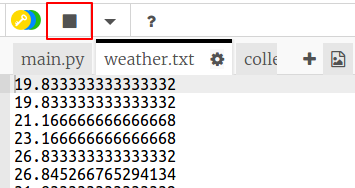

## ತಾಪಮಾನವನ್ನು ನಮೂದಿಸುವುದು

ಮೊದಲು ಪ್ರತಿ 5 ಸೆಕೆಂಡಿಗೆ ತಾಪಮಾನವನ್ನು ಫೈಲ್‌ಗೆ ಲಾಗ್ ಮಾಡೋಣ. ತಾಪಮಾನವನ್ನು ಬದಲಾಯಿಸಲು ನೀವು emulator ಅನ್ನು ಬಳಸಬಹುದು.

+ ಹವಾಮಾನ ಲಾಗರ್ ಸ್ಟಾರ್ಟರ್ Trinket ತೆರೆಯಿರಿ: <a href="http://jumpto.cc/weather-go" target="_blank"> jumpto.cc/weather-go </a>.
    
    **ನಿಮಗಾಗಿ ಕೆಲವು ಫೈಲ್‌ಗಳು ಮತ್ತು ಕೋಡ್ ಅನ್ನು ಹಾಕಲಾಗಿದೆ.**

+ `collect.py` ಕ್ಲಿಕ್ ಮಾಡಿ. ತಾಪಮಾನದ ಡೇಟಾವನ್ನು ಸಂಗ್ರಹಿಸಲು ನೀವು ಕೋಡ್ ಅನ್ನು ಬರೆಯುವ ಸ್ಥಳ ಇದು. `weather.txt` ಫೈಲ್ ಅನ್ನು ತೆರೆಯೋಣ ಮತ್ತು ಪ್ರತಿ ಐದು ಸೆಕೆಂಡಿಗೆ ತಾಪಮಾನವನ್ನು ಬರೆಯಿರಿ.
    
    `collect.py` ಗೆ ಹೈಲೈಟ್ ಮಾಡಿದ ಕೋಡ್ ಸೇರಿಸಿ:
    
    
    
    `a` ನೊಂದಿಗೆ ಫೈಲ್ ಅನ್ನು ತೆರೆಯಲಾಗುತ್ತಿದೆ ಅಂದರೆ ಫೈಲ್‌ನ ಕೊನೆಯಲ್ಲಿ ಡೇಟಾವನ್ನು ಸೇರಿಸಲಾಗುತ್ತದೆ.
    
    ಹೊಸ ಲೈನ್ ಅಕ್ಷರ `\n` ಅನ್ನು ಬರೆಯುವುದರಿಂದ, ಪ್ರತಿ ತಾಪಮಾನ ಓದುವಿಕೆಯನ್ನು ತನ್ನದೇ ಆದ ಸಾಲಿನಲ್ಲಿ ಇಡುತ್ತದೆ.

+ `weather.txt` ಕ್ಲಿಕ್ ಮಾಡಿ. ಅದು ಖಾಲಿಯಾಗಿರಬೇಕು. ಇಲ್ಲಿಯೇ ಡೇಟಾವನ್ನು ಸಂಗ್ರಹಿಸಲಾಗುತ್ತದೆ.
    
    

+ ಈಗ ರನ್ ಕ್ಲಿಕ್ ಮಾಡಿ. ತಾಪಮಾನವನ್ನು ಬದಲಾಯಿಸಲು ಎಮ್ಯುಲೇಟರ್ನಲ್ಲಿ ತಾಪಮಾನದ ಸ್ಲೈಡರ್ ಬಳಸಿ. ಪ್ರತಿ ಐದು ಸೆಕೆಂಡುಗಳಿಗೆ `weather.txt` ನ ಕೊನೆಯಲ್ಲಿ ಸೇರಿಸಲಾದ ತಾಪಮಾನ ಓದುವಿಕೆಯನ್ನು ನೀವು ನೋಡಬೇಕು.
    
    ಎಮ್ಯುಲೇಟರ್ ನಿಜವಾದ Sense HATನಂತೆ ವರ್ತಿಸಲು ಪ್ರಯತ್ನಿಸುತ್ತದೆ ಎಂಬುದನ್ನು ನೆನಪಿಡಿ. ಆದ್ದರಿಂದ ನೀವು ಎಮ್ಯುಲೇಟರ್ ಅನ್ನು ಬದಲಾಯಿಸದಿದ್ದರೂ ಸಹ ಅದೇ ಓದುವಿಕೆಯನ್ನು ನೀವು ನೋಡುವುದಿಲ್ಲ.
    
    

+ ನೀವು ಡೇಟಾವನ್ನು ಸಂಗ್ರಹಿಸುವುದನ್ನು ಪೂರ್ಣಗೊಳಿಸಿದಾಗ `ನಿಲ್ಲಿಸು` ಚೌಕದ ಬಟನನ್ನು ಕ್ಲಿಕ್ ಮಾಡಿ.
    
    

+ ನೀವು `weather.txt` ನಲ್ಲಿ ಡೇಟಾವನ್ನು ಹೈಲೈಟ್ ಮಾಡಬಹುದು ಮತ್ತು ನೀವು ಹೊಸ ತಾಪಮಾನದ ಡೇಟಾವನ್ನು ಸಂಗ್ರಹಿಸಲು ಪ್ರಾರಂಭಿಸಲು ಬಯಸಿದರೆ ಅದನ್ನು ಅಳಿಸಬಹುದು. ಸುಮಾರು 10 ತಾಪಮಾನದ ರೀಡಿಂಗ್ಸ್ ಸಂಗ್ರಹಿಸಿ.