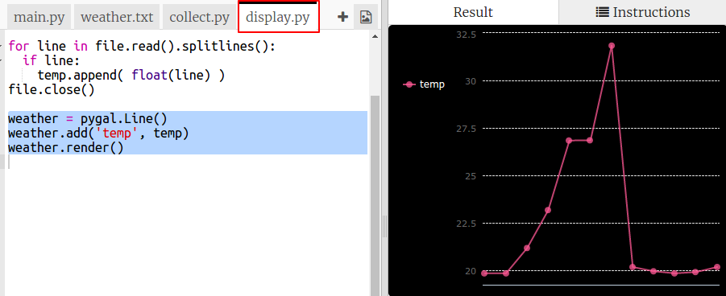

## ತಾಪಮಾನದ ಗ್ರಾಫ್ ರಚಿಸಲಾಗುತ್ತಿದೆ

ಈಗ ನೀವು ಕೆಲವು ತಾಪಮಾನದ ಡೇಟಾವನ್ನು ಸಂಗ್ರಹಿಸಿದ್ದೀರಿ. ಅದನ್ನು ಲೈನ್ ಗ್ರಾಫ್‌ನಲ್ಲಿ ತೋರಿಸೋಣ.

+ `main.py` ಕ್ಲಿಕ್ ಮಾಡಿ. ಈ ಸಮಯದಲ್ಲಿ ಅದು `collect.py` ತಾಪಮಾನದ ಡೇಟಾವನ್ನು ಸಂಗ್ರಹಿಸಲು ನೀವು ಬರೆದ ಸ್ಕ್ರಿಪ್ಟ್ ಅನ್ನು ಆಮದು (ಇಂಪೋರ್ಟ್) ಮಾಡುತ್ತದೆ. ಈಗ ಅದನ್ನು ಬದಲಾಯಿಸಿ. ಇದರಿಂದ ಅದು `display.py` ಸ್ಕ್ರಿಪ್ಟ್ ಅನ್ನು ಆಮದು ಮಾಡಿಕೊಳ್ಳುತ್ತದೆ.
    
    `import collect` ಸಾಲಿನ ಪ್ರಾರಂಭಕ್ಕೆ `#` ಅನ್ನು ಸೇರಿಸುವ ಮೂಲಕ ಮತ್ತು `import display` ಸಾಲಿನ ಪ್ರಾರಂಭದಿಂದ `#` ಅನ್ನು ತೆಗೆದುಹಾಕುವ ಮೂಲಕ ಕಾಮೆಂಟ್‌ಗಳನ್ನು ತೆಗೆದುಹಾಕಿ.
    
    ಈಗ `main.py` ಈ ರೀತಿ ಇರಬೇಕು:
    
    

+ ಡೇಟಾವನ್ನು ಪ್ರದರ್ಶಿಸಲು ಕೋಡ್‌ನಲ್ಲಿ ಕೆಲಸ ಮಾಡಲು `display.py` ಕ್ಲಿಕ್ ಮಾಡಿ. ನಿಮಗಾಗಿ ಸೇರಿಸಲಾಗಿರುವ Pygal ಲೈಬ್ರರಿಯನ್ನು ನೀವು ಬಳಸುತ್ತೀರಿ.
    
    

+ `weather.txt` ಫೈಲ್ ನಿಂದ ಮೌಲ್ಯಗಳನ್ನು ಓದಿ `temp` ಎಂಬ ಪಟ್ಟಿಗೆ ಸೇರಿಸಲು, ಹೈಲೈಟ್ ಮಾಡಿದ ಕೋಡ್ ಸೇರಿಸಿ.
    
    

+ ಮುದ್ರಿಸಲಾದ ವ್ಯಾಲ್ಯೂಸ್ ನೋಡಲು ಕೋಡ್ ಅನ್ನು ರನ್ನ ಮಾಡಿ. ನೀವು ನಿಮ್ಮ ಕೋಡನ್ನುಪರೀಕ್ಷಿಸಿದ ಮೇಲೆ `print` ಸಾಲನ್ನು ತೆಗೆಯಬಹುದು.

+ ಈಗ Pygal ಬಳಸಿ ಡೇಟಾದಿಂದ ಲೈನ್ ಗ್ರಾಫ್ ರಚಿಸವ ಕೋಡ್ ಅನ್ನು ಸೇರಿಸೋಣ.
    
    

+ ಡೇಟಾದಿಂದ y ಅಕ್ಷಕ್ಕೆ Pygal ಸ್ವಯಂಚಾಲಿತವಾಗಿ ಲೇಬಲ್‌ಗಳನ್ನು ರಚಿಸುತ್ತದೆ. X ಅಕ್ಷಕ್ಕೆ ಶೀರ್ಷಿಕೆ ಮತ್ತು ಲೇಬಲ್‌ಗಳನ್ನು ಸೇರಿಸೋಣ. ನಾವು ರೀಡಿಂಗ್ಸ್ ಅನ್ನು 1 ರಿಂದ ಪ್ರಾರಂಭಿಸಿ ಸಂಖ್ಯೆಗಳನ್ನು ಕೊಡಬಹುದು. ನಾವು ತಾಪಮಾನದ ಲಿಸ್ಟ್ನ ಉದ್ದಕ್ಕೆ ಒಂದನ್ನು ಸೇರಿಸುವ ಅಗತ್ಯವಿದೆ. ಆದ್ದರಿಂದ ಆ ಶ್ರೇಣಿಯು 1 ರಿಂದ ಲಿಸ್ಟ್ನ ಉದ್ದದ ಸಂಖ್ಯೆಗಳ ಲಿಸ್ಟನ್ನು ಹಿಂದಿರುಗಿಸುತ್ತದೆ.
    
    ಶೀರ್ಷಿಕೆ ಮತ್ತು ಲೇಬಲ್‌ಗಳನ್ನು ಸೇರಿಸಲು ಹೈಲೈಟ್ ಮಾಡಿದ ಕೋಡ್ ಸೇರಿಸಿ:
    
    