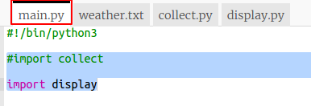

## तापमानाचा ग्राफ तैयार करणे

आता आपण काही तापमान डेटा संग्रहित केला आहे तो एक रेखांकन वर दर्शवू.

+ `main.py` वर क्लिक करा. या क्षणी ते आपण तापमान डेटा संकलित करण्यासाठी लिहिलेली `collect.py` स्क्रिप्ट इम्पोर्ट करते. आता ते बदला जेणेकरून ते त्याऐवजी `display.py` स्क्रिप्ट इम्पोर्ट करेल.
    
    सुरुवातीस `#` जोडून `import collect`ओळीवर टिप्पणी द्या आणि `#` `import display` ओळ काढा.
    
    `main.py` आता अशी दिसायला हवे:
    
    

+ डेटा प्रदर्शित करण्यासाठी कोड वर कार्य करण्यासाठी `display.py` वर क्लिक करा. आपल्यासाठी समाविष्ट केलेले Pygal लायब्ररी चा आपण वापर करेल.
    
    

+ `temp` लिस्ट मधील `weather.txt` फाइल मधील मूल्ये वाचण्यासाठी हायलाइट केलेला कोड जोडा.
    
    

+ मुद्रित मूल्ये पाहण्यासाठी कोड run करा. आपण आपल्या कोडची चाचणी घेतली तेव्हा आपण `print` ओळ काढू शकता.

+ आता Pygal वापरून डेटा मधून रेशीय आलेख तयार करण्यासाठी कोड जोडा.
    
    

+ Pygal डेटा मधून स्वयंचलित पणे y एक्सिससाठी लेबल तयार करते. X एक्सिससाठी शीर्षक आणि लेबले जोडा. आपण वाचनाची संख्या 1 पासून क्रमांक देऊ शकतो. आपण तापमान सूचीच्या लांबी मध्ये एक जोडण्याची आवश्यकता आहे जेणेकरुन ती श्रेणी 1 पासून यादीच्या लांबी पर्यंतच्या क्रमांकाची यादी परत करेल.
    
    शीर्षक आणि लेबले जोडण्यासाठी हायलाइट केलेला code जोडा:
    
    