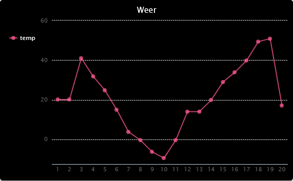

## Inleiding

In dit project verzamel je gegevens van de sensoren van de Sense HAT en leg je deze vast in een bestand. Vervolgens gebruik je de PyGal-module om die gegevens weer te geven als een lijngrafiek.

  <iframe src="https://trinket.io/embed/python/bf02eb20a4?outputOnly=true&start=result" width="600" height="500" frameborder="0" marginwidth="0" marginheight="0" allowfullscreen mark="crwd-mark">
</iframe> 

### Aanvullende informatie voor clubleiders

Als je dit project wilt afdrukken, gebruik dan de [printervriendelijke versie](https://projects.raspberrypi.org/nl-NLew/projects/weather-logger/print).

--- collapse ---
---
title: Opmerkingen voor docenten
---

## Inleiding:

In dit project, zullen kinderen leren hoe ze data uit de Sense HAT sensoren moeten opslaan in een bestand. En deze vervolgens weer te geven in een grafiek, gebruik makend van Pygal.

## Online bronnen

**Dit project maakt gebruik van Python 3.** We raden aan om [Trinket](https://trinket.io/) te gebruiken om Python online te schrijven. Dit project bevat de volgende Trinkets:

* ['Weerlogboek' starters-trinket -- jumpto.cc/weather-go](http://jumpto.cc/weather-go)

Er is ook een trinket met het voltooide project:

* [‘Weerlogboek’ Voltooid -- trinket.io/python/bf02eb20a4](https://trinket.io/python/bf02eb20a4)

## Offline bronnen

Dit project kan ook [offline voltooid worden](https://www.codeclubprojects.org/en-GB/resources/physical-sense-hat/) op een Raspberry Pi-computer met een Sense HAT. Je kunt toegang krijgen tot de projectbronnen door op de koppeling 'Projectmaterialen' voor dit project te klikken. Deze link bevat een 'Projectbronnen'-sectie die bronnen bevat om dit project offline te voltooien. Zorg ervoor dat elk kind toegang heeft tot een kopie van deze bestanden. Dit gedeelte bevat de volgende bestanden:

* weather/main.py
* weather/collect.py
* weather/display.py
* weather/weather.txt

Je kunt ook een voltooide versie van dit project vinden in de sectie 'Vrijwilligersbronnen', die het volgende bevat:

* weather-finished/main.py
* weather-finished/collect.py
* weather-finished/display.py
* weather-finished/weather.txt

(Alle bovenstaande bronnen kunnen ook worden gedownload als project en als vrijwilliger `.zip` bestanden.)

## Leerdoelen

* Fysiek computergebruik - sensoren;
* Gegevens - schrijven naar en het lezen van bestanden.

Dit project behandelt elementen uit de volgende onderdelen van het [Raspberry Pi Digital Making Curriculum](http://rpf.io/curriculum):

* [Combineer programmeerconstructies om een ​​probleem op te lossen.](https://www.raspberrypi.org/curriculum/programming/builder)

## Uitdagingen

* Simuleer verschillende weersomstandigheden - gebruik de Sense HAT-emulator om verschillende weersomstandigheden te simuleren. 
* Registreer en toon de vochtigheid of druk - registreer gegevens van een andere Sense HAT sensor en maak een grafiek van de resultaten. 

--- /collapse ---

--- collapse ---
---
title: Projectmaterialen
---

## Projectbronnen

* [.zip-bestand met alle projectbronnen](resources/weather-logger-project-resources.zip)
* [Weerlogboek startersproject](http://jumpto.cc/weather-go)
* [Offline start Python-bestand](resources/weather-logger-main.py)
* [Offline Python bestand voor het verzamelen van gegevens](resources/weather-logger-collect.py)
* [Offline Python bestand voor het weergeven van gegevens](resources/weather-logger-display.py)
* [Offline bestand met weergegevens](resources/weather--loggerweather.txt)

## Clubleider bronnen

* [.zip-bestand met alle voltooide projectbronnen](resources/weather-logger-volunteer-resources.zip)
* [Online voltooid trinket Weerlogboek project](https://trinket.io/python/bf02eb20a4)
* [Offline start Python-bestand](resources/weather-logger-finished-main.py)
* [Offline Python bestand voor het verzamelen van gegevens](resources/weather-logger-finished-collect.py)
* [Offline Python bestand voor het weergeven van gegevens](resources/weather-logger-finished-display.py)
* [Offline bestand met weergegevens](resources/weather-logger-finished-weather.txt)

--- /collapse ---