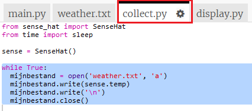
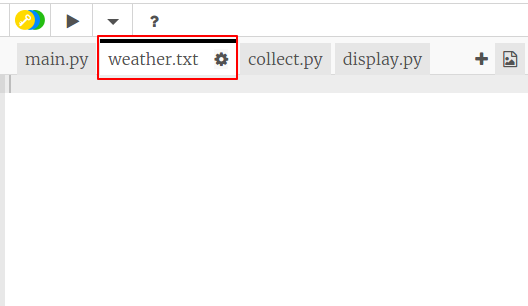

## Vastleggen van temperatuur

Laten we eerst de temperatuur elke 5 seconden in een bestand vastleggen. Je kunt de emulator gebruiken om de temperatuur te veranderen.

+ Open de weerlogboek starter Trinket <a href="http://jumpto.cc/weather-go" target="_blank">jumpto.cc/weather-go</a>.
    
    **Enkele bestanden en code zijn voor je toegevoegd.**

+ Klik op `collect.py`. Dit is waar je de code schrijft om de temperatuurgegevens te verzamelen. Laten we het `weather.txt` bestand openen en om de vijf seconden de temperatuur noteren.
    
    Voeg de gemarkeerde code toe aan `collect.py`:
    
    
    
    Als je het bestand opent met `a` worden de gegevens aan het einde van het bestand toegevoegd.
    
    Het schrijven van een nieuw regel teken `\n` plaatst elke gemeten temperatuur op een eigen regel.

+ Klik op `weather.txt`. Het hoort leeg te zijn. Hier wordt de data opgeslagen.
    
    

+ Klik nu op Run. Gebruik de temperatuurschuifregelaar op de emulator om de temperatuur te wijzigen. Je zou de temperatuurmeting elke vijf seconden aan het einde van `weather.txt` moeten zien worden toegevoegd.
    
    Onthoud dat de emulator zich probeert te gedragen als een echte Sense HAT, zodat je niet precies dezelfde metingen zult zien, zelfs als je de emulator niet verandert.
    
    

+ Klik op de knop `Stop` als je klaar bent met het verzamelen van gegevens.
    
    

+ Je kunt de gegevens in `weather.txt` markeren en verwijderen als je nieuwe temperatuurgegevens wilt gaan verzamelen. Verzamel ongeveer 10 temperatuurmetingen.