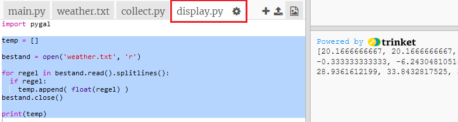
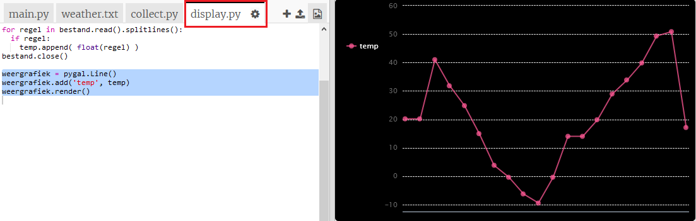
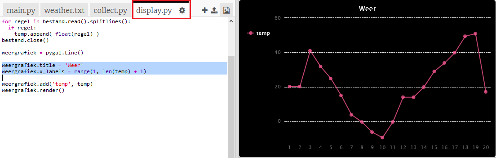

## Een temperatuurgrafiek maken

Nu je enkele temperatuurgegevens hebt verzameld, gaan we deze in een lijngrafiek weergeven.

+ Klik op `main.py`. Op dit moment importeert het het `collect.py` script dat je hebt geschreven om de temperatuurgegevens te verzamelen. Verander het nu zodat het het `display.py` script importeert.
    
    Geef commentaar op de `import collect` regel door het toevoegen van een `#` aan het begin. En verwijder de `#` aan het begin van de `import display` regel.
    
    `main.py` zou er nu als volgt uit moeten zien:
    
    

+ Klik op `display.py` om te werken aan de code voor het weergeven van de gegevens. Je zult gebruik maken van de Pygal bibliotheek, deze is voor je meegeleverd.
    
    

+ Voeg de gemarkeerde code toe om de waarden uit het bestand `weather.txt` te lezen en in een lijst met de naam `temp` te zetten.
    
    

+ Voer de code uit om de waardes te zien die worden afgedrukt. Je kunt de `print` regel verwijderen, als je de code hebt getest.

+ Laten we nu de code toevoegen om een lijngrafiek van de gegevens te maken met Pygal.
    
    

+ Pygal maakt automatisch labels voor de y-as op basis van de gegevens. Laten we een titel en labels toevoegen aan de x-as. We kunnen de meetwaarden nummeren vanaf 1. We moeten één toevoegen aan de lengte van de temperatuurlijst, zodat de range-functie een lijst met nummers teruggeeft van 1 tot en met de lengte van de lijst.
    
    Voeg de gemarkeerde code toe om een titel en labels toe te voegen:
    
    